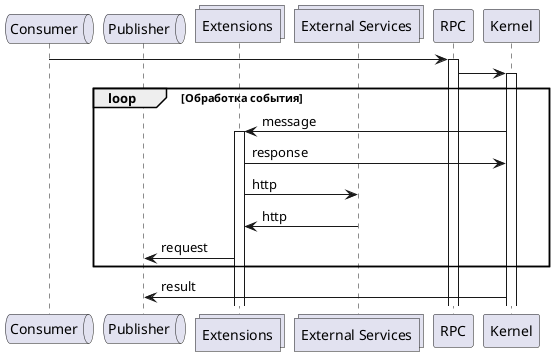

# Задания к блоку "Введение в разработку" курса "Системный аналитик"
## Легенда
После окончания обучения вашим первым проектом стал сервис 
доставки еды из ресторана "Суши из Хрюши". Но за две недели 
до релиза уволился фронтенд-разработчик. 
Руководитель разработки пролистал резюме всей команды 
еще раз и увидел, что вы указали в своём знание Javascript. 
Разумеется, никто с вас не требует довести проект до совершенства,
но некоторые баги срочно требуется решить. 

Хорошо, что разработчик написал комментарии по каждой ошибке, 
есть шанс, что вы справитесь, если вспомните то, чему вас в 
свое время научили в "Нетологии".

## Информация, требуемая для выполнения любого задания модуля
[1. Начало работы на модуле](before.md)

[2. Руководство по стилю кода](styleguide.md)

[3. Тестирование решений](test.md)

[4. Отправка на проверку](after.md)

## Задания
[1. Задание к занятию "Введение в разработку ПО"](task_1/readme.md)

[2. Задание к занятию "Логика и ветвления"](task_2/readme.md)

[3. Задание к занятию "Сложные структуры данных"](task_3/readme.md)

[4. Задание к занятию "Циклы и производительность"](task_4/readme.md)

[5. Итоговое задание "Подготовка данных к отправке"](task_final/readme.md)


# DialogOs Business Logic Service

[//]: # (В этом разделе необходимо дать краткое, но полноценное описание сервиса, по которому можно первично понять его назначение и функциональность)

**DialogOs Business Logic Service (bls)** – сервис отвечающий за процесс обработки и маршрутизации входящих сообщений от Пользователей между сервисами DialogOs.

Сервис bls входит в Диалоговое Ядро (Dialog Core) платформы DialogOs реализуя логику отдельных диалоговых пространств внутри одного экземпляра платформы DialogOs.

В задачи сервиса входит:
- Получение и обработка входящих сообщений в рамках диалоговых сессий с ассистентами платформы DialogOs. 
- Ведение контекста диалоговых сессий через **DOS Bot Management Service**.
- Журналирование сообщений в рамках их обработки через **DialogOs Journaling Service**.
- Маршрутизация сообщений в сервисы live операторов через **DialogOs Operator Gateway**.
- Реализация взаимодействия с интеграционными сервисами через **DialogOs Integration Service**.
- Выполнение пост-функций через **DialogOs Functions Gateway**.

## Техническая документация

### Конфигурация

[//]: # (@todo необходимо перечислисть все переменные окружения и другие методы конфигурации сервиса, включая те, что не предусмотрены логикой сборки, а используются только при локальной разработке)

Конфигурация сервиса реализуется через переменные окружения, перечисленные ниже:

#### ЛОГИРОВАНИЕ И ТРАССИРОВКА
```yaml
NLAB_K8S_NAMESPACE: Наименование пространства k8s для записи в логи, если сервис запущен в k8s.
NLAB_JAEGER_ENABLE: Включение и выключение трассировки.
# Допустимые значения: TRUE/FALSE. По умолчанию трассировка отключена.
NLAB_BLS_SENTRY_ENABLE: Включение и выключение использования сервиса сбора исключений и ошибок.
# Допустимые значения: TRUE/FALSE. По умолчанию сбор исключений и ошибок отключен.
NLAB_ELK_ENABLE: Включение и выключение отправки логов в logstash.
# Допустимые значения: TRUE/FALSE. По умолчанию отправка логов в logstash отключена.
NLAB_PROMETHEUS_ENABLE: TRUE
```

**Jaeger**
```yaml
# Для настройки сервиса трассировки Jaeger используются переменные описанные в
#  документации(https://www.jaegertracing.io). Ниже приведены основные переменные,
#  которые необходимо указывать для корректной работы трассировки.
JAEGER_TAGS: Список тэгов, которые будут добавлены к трассировке.
JAEGER_AGENT_HOST: Хост агент сервиса jaeger.
JAEGER_AGENT_PORT: Порт агент сервиса jaeger.
```

**Sentry**
```yaml
NLAB_BLS_SENTRY_DSN: Настройка подключения к сервису сбора исключений и ошибок Sentry
NLAB_BLS_SENTRY_ENVIRONMENT: Название окружения в котором запущен сервис
```

**ELK**
```yaml
NLAB_ELK_HOST: Адрес сервера логирования logstash. 
NLAB_ELK_LEVEL: Уровень логирования
NLAB_ELK_LOG_STYLE: Стиль логирования
#  Возможные значения NLAB и StrictBank
NLAB_ELK_PORT: Порт для обращения к серверу логирования logstash.
```

**Swagger**
```yaml
NLAB_SWAGGER_DOC_URL: Адрес swagger-документации сервиса
NLAB_SWAGGER_ENABLE: Включение и выключение динамической документации
NLAB_SWAGGER_REDOC_URL: Адрес swagger-документации сервиса в формате redoc
```

#### НАСТРОЙКИ СЕРВИСА
```yaml
NLAB_BLS_AMQP_DSN: Настройка подключения к серверу AMQP очередей RabbitMQ в виде DSN amqp.
#  Структура AMQP DSN: {LOGIN}:{PASSWORD}}@{HOST}:{PORT}//{VHOST}?exchange_name={EXCHANGE}&queue_name={QUEUE}
NLAB_BLS_APP_PORT: Настройка на каком порту http-приложение будет ожидать запросы
NLAB_BLS_SERVICE_NAME: Название сервиса с которым будет ассоциировано логирование и трассировка.
NLAB_DIALOG_CORE_NAME: Название Диалогового Ядра. Используется для выбора направления запросов конкретного канала
```

**Redis**
```yaml
NLAB_BLS_REDIS_DSN: Настройка подключения к серверу Redis в виде DSN redis.
#  Структура AMQP DSN: redis://{HOST}:{PORT}/{DB}
NLAB_BLS_REDIS_ENCODING: Кодировка запросов к Redis
```

**Dialog Processor**
```yaml
NLAB_BLS_DP_DEFAULT: Тип Диалогового Просцессора по умолчанию, если его тип не указан в настройках канала
NLAB_BLS_DP_SERVICE_DSN: Настройки подключения к Диалоговому Процессору в виде DSN
NLAB_BLS_DP_SERVICE_TIMEOUT: Время ожидания ответа от Диалогового Процессора
NLAB_PYDP_DSN: Настройки подключения к PyDP в виде DSN
```

**Intergation Service**
```yaml
NLAB_BLS_INTEGRATION_SERVICE_EXCHANGE: Название aqmp-exchange для передачи сообщений к Integration Service
```

**Bot Management Service**
```yaml
NLAB_BMS_DSN: Настройки подключения к BMS в виде DSN
NLAB_BLS_BMS_RESPONSE_TIMEOUT: Время ожидания ответа от сервиса BMS
```

**Audit Service**
```yaml
NLAB_BLS_AUDIT_EXCHANGE: Название aqmp-exchange для передачи сообщений к Audit Service
```

**Journaling Service**

[//]: # (@todo переименовать в JOURNALING - добавить стандарт для указания обменников и очередей!)
```yaml
NLAB_BLS_JOURNAL_EXCHANGE: Название aqmp-exchange для передачи сообщений к Journaling Service
```

**Operator Service**
```yaml
NLAB_BLS_OPERATOR_EXCHANGE: Название aqmp-exchange для передачи сообщений к Operator Gateway
```

**Function Service**
```yaml
NLAB_BLS_OPENFAAS_DSN: Настройки подключения к Function Service в виде DSN
NLAB_BLS_OPENFAAS_TIMEOUT: Время ожидания ответа от Function Service

```

### Описание сервиса

[//]: # (@todo Необходимо описат технические параметры сервиса такие как: схему работы, порты, процесс и прочие параметры связанные с технической стороной его работы)

### Зависимости

[//]: # (@todo Необходимо дать ссылки на файлы, описывающие зависимости и правила их выбора, если таких фалов больше одного)

### Модули ???

[//]: # (@todo необходимо перечислисть все подмодули, используемые в сервисе - специальная фишка этого сервиса)


### Сборка сервиса

[//]: # (@todo Необходимо описать правила сборки сервиса как в локальном режиме разработки, так )


[//]: # (@todo Необходимо дописать какие еше задачи выполняет сервис.)

### Локальная разработка

[//]: # (@todo необходимо описать логику локальной разработки - в отдельном файле develop.md)

При первом запуске стянуть докер контейнер для поддержки
BUILDKIT синтаксиса
```shell script
docker pull docker/dockerfile:1.0-experimental
```

После этого сбилдить сам контейнер для работы
```shell script
DOCKER_BUILDKIT=1 docker build . -t dos-bls --progress=plain --build-arg NLAB_PYPI_TOKEN=$NLAB_PYPI_TOKEN --build-arg NLAB_PYPI_REGISTRY=$NLAB_PYPI_REGISTRY --build-arg NLAB_PYPI_USER=$NLAB_PYPI_USER -f rhel.dockerfile
```

После можно запустить всё командой
```shell script
docker-compose up
```

Пример .env файла
```
NLAB_BLS_AMQP_ENABLED=false - отключить AMQP консьюмер
APS_MAX_FILTERS=1
APS_START_FILTERS=0
APS_MIN_FILTERS=0
APS_LOG_LEVEL=4
IFS_LOG_LEVEL=DEBUG
IFS_LOG_DATA_FLOW=TRUE
IFS_CACHE_TTL=604800
IFS_HVS_HOST=hvs.local
IFS_HVS_PORT=27017
NLAB_DLPATH=/home/sehat/volumes
_
NLAB_DEBUG=false
NLAB_JAEGER_ENABLE=true (default **false**)
JAEGER_AGENT_HOST=jaeger
JAEGER_AGENT_PORT=6831


NLAB_BLS_QUEUE=bls
NLAB_BLS_EXCHANGE=sapi

NLAB_AMQP_DSN=amqp://${NLAB_AMQP_USER}:${NLAB_AMQP_PASSWORD}@${NLAB_AMQP_HOST}:${NLAB_AMQP_PORT}/
NLAB_BLS_AMQP_DSN=${NLAB_AMQP_DSN}/${NLAB_AMQP_VHOST}?queue_name=${NLAB_BLS_QUEUE}&exchange_name=${NLAB_BLS_EXCHANGE}

NLAB_ENGINE_DSN=tcp:engine:2255

NLAB_BLS_VERSION=1.0.0
NLAB_BLS_SERVICE_NAME=bls

# BMS
NLAB_DIALOG_CORE_NAME="dialog core name'
NLAB_BMS_DSN=http://${NLAB_BMS_HOST}:${NLAB_BMS_HOST}

NLAB_BLS_SENTRY_DSN=https://${NLAB_BLS_SENTRY_ID}@${NLAB_SENTRY_HOST}/${NLAB_BLS_SENTRY_DB}
NLAB_BLS_SENTRY_ENABLE=false (default **true**)
NLAB_BLS_SNTRY_TO_CONSOLE=false (default **true**)


# NLAB_ELK
NLAB_ELK_HOST=elk
NLAB_ELK_PORT=5959 (default **5959**)
NLAB_ELK_LEVEL=DEBUG
NLAB_ELK_ENABLE=false (default **true**)
removed: NLAB_ELK_LOG=TRUE (default **false**)
removed: NLAB_ELK_DATABASE_PATH=.nlab-logstash.db

NLAB_BLS_APP_WORKERS=<n> (default **1**)
```
## Внутреннее устройство сервиса

### Зависимости

[//]: # (@todo необходимо указать все сервисы, к которым обращается сервис)

### Тестирование

### Логика

### Протоколы взаимодйствия

#### Протокол AMQP


Для взаимодействия с иными сервисами используется как AQMP, так и HTTP. В целом тушки и заголовки примерно одинаковы и описаны ниже.

HEADER
```
| Имя поля        | тип                | описание                     |
| --------------- | ------------------ | ---------------------------- |
| uber-trace-id   | str                | jaeger trace id              |
| reqid           | UUID:str           | UUID запроса                 |
| content_type    | "application/json" | константа "application/json" |
| destination     | str                | exchange для ответа          |
| client_auth_key | str                | client Auth Key              |
| client_host     | str                | client host                  |
| duid            | UUID:str           | Dialog UUID                  |
| buid            | UUID               | Bot UUID                     |
| kind            | str                | Тип запроса                  |
```

Получение диалоговых запросов

Значения поля kind
```
| Значение             | тип | описание                 |
| -------------------- | --- | ------------------------ |
| dlg.message.request  | str | запрос пользователя      |
| dlg.event.request    | str | событие в рамках диалога |
| dlg.sysevent.request | str | системное событе         |
| dlg.rate.request     | str | запрос оценки            |
```

BODY общий
```
| Имя поля | тип     | описание         |
| -------- | ------- | ---------------- |
| context  | словарь | Контекст запроса |
| meta     | словарь | Метаконтекст     |
```
Для разных типов запросов BODY дополняется полями
```
| Имя поля | тип      | тип запроса |
| -------- | -------- | ----------- |
| euid     | UUID:str | Event       |
| text     | str      | Request     |
``` 
Данные для запроса Rate (оценка) передаются в ключе rate поля meta 
```
| Имя поля | тип      | описание                            |
| -------- | -------- | ----------------------------------- |
| rate     | int:str  | значение оценки, число в строке     |
| msgid    | UUID:str | uuid оцениваемого запроса           |
| comment  | str      | необязательный комментарий к оценке |
```
Также в поле meta передаются данные отслеживания источника запроса

Передача ответов в рамках диалога.
Ответы передаются AMQP exchange, полученный из HEADER.destination

BODY общий
```
| Имя поля | тип      | описание                      |
| -------- | -------- | ----------------------------- |
| cuid     | UUID:str | DUID                          |
| context  | словарь  | изменившийся контекст диалога |
```
BODY для ответов
```
| Имя поля   | тип             | описание                                                                              |
| ---------- | --------------- | ------------------------------------------------------------------------------------- |
| text       | словарь         | содержит строку в ключе value для ответа pydp/api/v1                                  |
| raw_anwser | список словарей | согласно структуре ответа для pydp/api/v2                                             |
| error      | строка          | возникшая при обработке запроса ошибка. обычно трейс. и вот над этим надо поработать* |
|            |                 |                                                                                       |
```
* предлагаю информацию об ошибке поместить в BODY (вместо просто строки), клиенту можно передать только status_code:
```json
{
    "error": {
        "status_code": OSerror.code/http.status_code: int,
        "message": "текстовое описание или трейс"
    }
}
```
Для отправки запросов в exchange Operator Gateway используется значение env NLAB_BLS_OPERATOR_EXCHANGE.


Получение запросов от Operator Gateway

HEADER. отличается от HEADER диалогового запроса значением поля kind
```
| Значение         | тип | описание                      |
| ---------------- | --- | ----------------------------- |
| operator_event   | str | событие из Operator Gateway   |
| operator_message | str | сообщение из Operator Gateway |
```
BODY
```
| Имя поля | тип     | описание                         |
| -------- | ------- | -------------------------------- |
| meta     | словарь | Метаконтекст                     |
| context  | словарь | Контекст                         |
| text     | str     | Сообщение оператора              |
| type     | str     | Тип сообщения из Opertor Gateway |
```
Типы запросов из OperatorGateway. 
для kind: operator_event - управление состоянием сессии.
```
| Значение type      | тип | описание                            |
| ------------------ | --- | ----------------------------------- |
| dialog_started     | str | Диалог с оператором начался         |
| dialog_finished    | str | Диалог с оператором завершён        |
| dialog_passthrough | str | Сообщение оператора                 |
| no_operator        | str | Нет доступных операторов            |
| operator_error     | str | Возникла ошибка на Operator Gateway |
| operator_check     | str |                                     |
```
для kind: operator_message - передать сообщение оператора.
```
| Значение type    | тип | описание               |
| ---------------- | --- | ---------------------- |
| operator_message | str | Сообщение от оператора |
|                  |     |                        |
```

Передача ответа.
При передаче ответа копируется заголовок из запроса. Формат тела ответа зависит от типа пришедшего запроса или ошибки про обработке (выше).
Ответы передаются в exchange AMQP, полученный из HEADER.destination.
